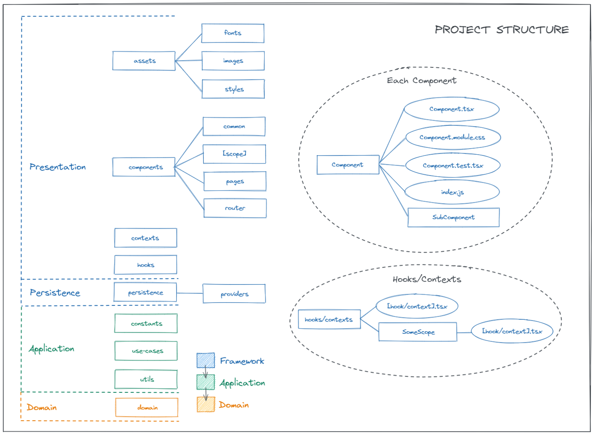

# Frontend Base Template

Use this template to create a new frontend project.

## Installation

First, instead of cloning the repository, you can use the `Use this template` button to create a new project.

Then, you'll need to install the dependencies using the `npm install` command.

In addition, you have to copy the `.env.sample` file on the root of your project and rename it as `.env`. Then fill the required fields.

## Usage
Once created, you can use the following commands to start the project: `npm start` or `yarn start`. This will start the development server and watch for file changes to hot refresh the app.

There is also a `npm run cc` and `yarn run cc` command that will create a new react component based on your preferences. It will include styles file, test file and a basic component.

## Deployment
You can generate all the necessary files to deploy your project to a production server using the `npm run build` or `yarn run build` command. This will generate a `build` folder with all the necessary files which you can deploy to your production server.

## Engines
- `node >= 14`
- `npm >= 7`

## Structure

This project uses the following structure based on clean architecture principles:

